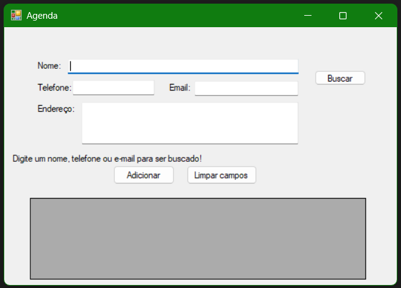

# 📘 ProjetosCSharp

Este repositório contém um projeto desenvolvido em **C#** com integração ao banco de dados **MySQL**, criado no **Microsoft Visual Studio** utilizando **Windows Forms**. O projeto, chamado "Agenda com BD", é uma aplicação simples para gerenciar contatos, permitindo cadastrar, buscar, alterar e excluir informações como nome, telefone, e-mail e endereço.

---

## 🛠️ Requisitos

- **Microsoft Visual Studio** (versão compatível com Windows Forms).
- **MySQL Server** instalado e configurado.
- **Conector MySQL para .NET** (MySql.Data) instalado no projeto.
- Sistema operacional **Windows** (para Windows Forms).

---

## 📂 Estrutura do Repositório

O repositório contém uma pasta chamada `AgendacomBD`. Dentro dela, há o arquivo `print.png`, que mostra uma captura de tela do programa em execução, o arquivo `agenda.sql`, que é o script para criar o banco de dados MySQL, e a pasta `WindowsFormApp1`, onde estão todos os arquivos do projeto, incluindo o código-fonte e os forms desenvolvidos no Visual Studio.

---

## ▶️ Como Executar os Códigos

1. **Configurar o Banco de Dados:**
   - Abra o MySQL Workbench ou outra ferramenta de gerenciamento de banco.
   - Execute o script `agenda.sql` para criar a tabela de contatos.

2. **Abrir o Projeto:**
   - Clone este repositório (veja "Como baixar o repositório" abaixo).
   - Abra a pasta `AgendacomBD/WindowsFormApp1` no Microsoft Visual Studio.

3. **Configurar a Conexão:**
   - No código, ajuste a string de conexão com o MySQL (usuário, senha, host, etc.) no arquivo correspondente (geralmente `Program.cs` ou um arquivo de configuração).

4. **Executar:**
   - Pressione `F5` no Visual Studio para compilar e rodar o projeto.
   - A interface gráfica será exibida, permitindo o gerenciamento de contatos.

*Nota:* Veja o arquivo `print.png` para um exemplo da interface em execução.

---

## 📥 Como Baixar o Repositório

1. Clique no botão verde "Code" no topo da página do GitHub.
2. Selecione "Download ZIP" e extraia o arquivo no seu computador.
3. Ou use o Git: `git clone https://github.com/cstavaresj/ProjetosCSharp.git`

---

## 📸 Screenshot

